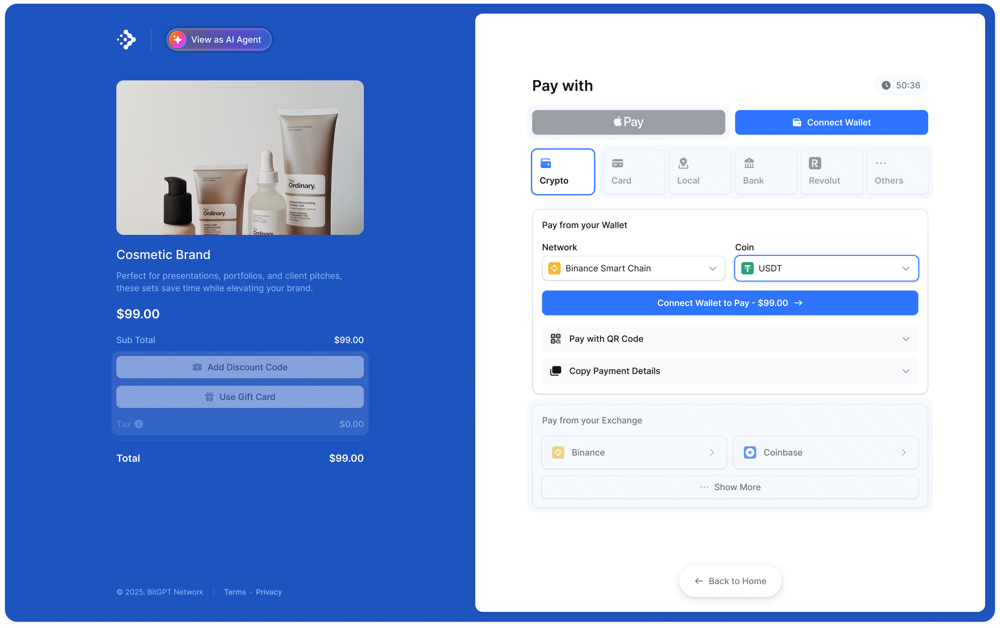
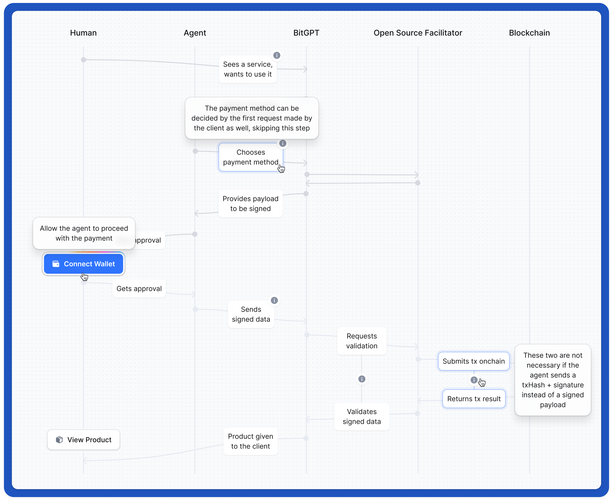

# HTTP 402 protocol

HTTP 402 is the web-native standard for payments. Our mission is to design a frictionless machine-to-machine protocol that allows agents to pay for APIs, compute resources, and data using simple HTTP requests and native blockchain transactions scaling to billions of sub-cent microtransactions.

This unlocks a previously unattainable economic layer for AI-native commerce, while simultaneously delivering a best-in-class user experience for humans.

```js
app.use(
  "/generate-image",
  monetize({
    schema: "exact",
    amount: 0.001,
    token: "USDT",
    chainId: 56, // BSC mainnet
    namespace: "eip155",
  })
);
```

This protocol builds on top of [x402](https://github.com/coinbase/x402), with minimal deviations from its schema to ensure the continuation and adoption of a true open standard.

## Playground

To detail and showcase our idea of the 402 protocol, we've built a public playground available at [play.bitgpt.xyz](https://play.bitgpt.xyz). It demonstrates how the 402 payment flow works in comparison to traditional human checkouts.

In a typical crypto checkout, users go through multiple steps—connecting a wallet, signing a transaction, and broadcasting it.



While this flow mirrors traditional credit card payments, it’s unsuitable for machine-based transactions. Agents require a native protocol built for programmatic interaction, not one retrofitted from human-centric experiences.

Our playground illustrates the 402 flow from the agent's perspective: initiating payments on the user's behalf, negotiating terms, and requesting final confirmation from the user.

This interface is demo-only; in real-world use, these interactions occur purely via HTTP between the agent (acting for the user) and the server (BitGPT or any service provider).


The 402 flow can vary based on the payment schema and user-agent configuration. For instance, in the absence of a default payment method, the user must manually select one.

- `exact`: Simple flow with known amount.
- `upto`, `prepaid`, `streamed`, `subscription`, `postpaid`: More dynamic, require negotiation or ongoing interaction.



The playground is still under active development. While it currently mocks the protocol and checkout interface, more examples and features will be added soon, both here and in the soon-to-be-open-sourced repository.


## Roadmap

Our vision for h402 is to establish a robust, open-source protocol for blockchain-native payments, not just as a solution for the ecosystem, but to fulfill a real need we face ourselves in standardizing agent-based blockchain transactions.

We're actively building a [payment platform](https://dash.bitgpt.xyz) to support both traditional merchants and autonomous agents. This platform will be based on the open protocol for seamless payment acceptance, remittance, and automation.

Upcoming releases in Q2 2025 will include new protocol schemas:

- `upto`
- `prepaid`
- `streamed`
- `subscription`
- `postpaid`

## Community

Join our [Discord community](https://bitgpt.xyz/discord) to stay up to date, contribute to feature development, and connect directly with our team.

## TODO

- Expand this README with detailed schema documentation, code examples, and functionality breakdowns
- Add real-world examples
- Provide a one-liner for frontend integration
- Add SDKs for languages beyond TypeScript
- Release public facilitator APIs for open use
- Support additional schemas
- Support Solana, Bitcoin, Tron, and Ripple
- Add unit tests
- Add vulnerability protocol inside SECURITY.md
- Add security best practices (be detailed about what goes with what), examples below:
  - payload comes from the client and paymentDetails are from the server
  - have verify and settle in a signle route as payload may be tampered with on the client
- Document functions with JSDoc
- Say somewhere the supported networks
- Say that this is the v1 documentation
- Add shceme specific docs and explain them seperatly and only put a link here
- Probably change namespaces name to be more friendly ie "evm", "bitcoin", etc.
- Review the first example in the README to be congruent with the required types
- IMPORTANT: Change the imports in the package
- IMPORTANT: Be sure that the package is accesible as @bit-gpt/h402 and not @bit-gpt/h402/dist/src
- Improve structure.. Improve types.. Improve everything

## License

The h402 protocol is licensed under the [Apache-2.0](https://github.com/coinbase/x402/blob/main/LICENSE.md) license.
